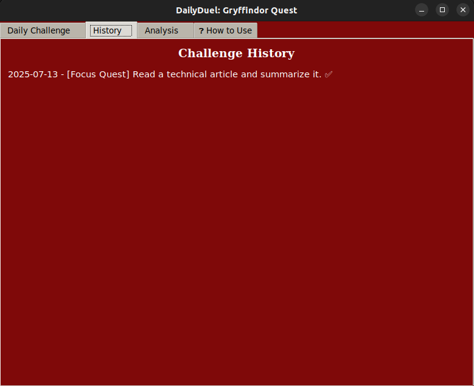
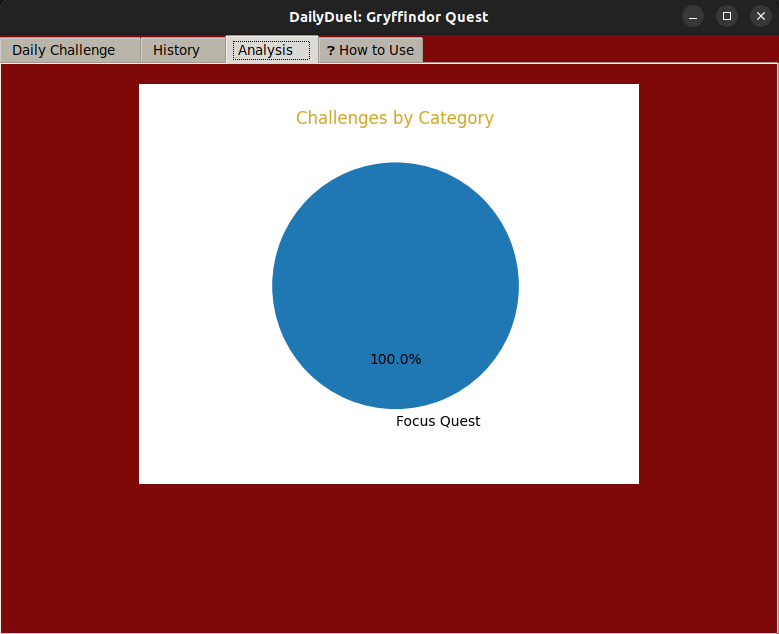
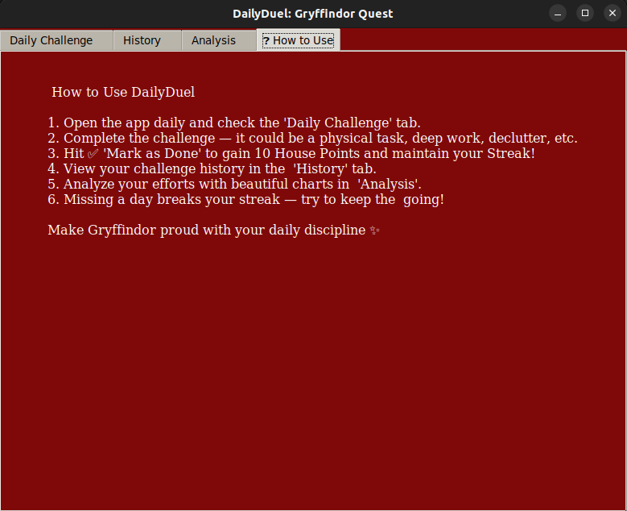

# 🦁 DailyDuel: Rise Like a Gryffindor, One Habit at a Time!

DailyDuel is a **Gryffindor-themed daily productivity streak game** that transforms your day into a challenge of courage, consistency, and focus. It's not just a habit tracker—it's a **battle against procrastination**, where every check-in earns you glory, and every miss costs you progress.

> ⚔️ *"What you do daily is what makes you legendary."*

---

## 🎯 Features

- ✅ **Daily Task Duel** – Pick one daily target & beat procrastination.
- 📈 **Streak Tracker** – Track your win streak and see your consistency grow.
- 📅 **History Log** – Visualize your past wins in a timeline.
- 💡 **How to Use** – Built-in guide for quick understanding.
- 🔥 **Motivational Quotes** – Random wisdom from the Wizarding World.
- 🧙‍♂️ Gryffindor UI Theme – Immersive experience with themed colors & emojis.
- 📊 Auto-save progress locally (lightweight JSON).
- 💻 **Cross-platform:** Linux, macOS, Windows (builds available via GitHub Releases).

---

## 📦 Installation

### 🖥️ Run from Source

Make sure you have **Python 3.9+** installed.  
Then run:

```bash
pip install -r requirements.txt
python DailyDuel.py
```

### Screenshots

> 

> 

> 

> 


